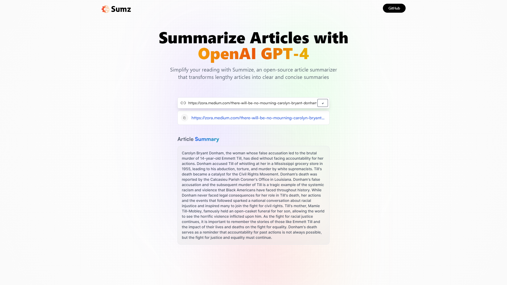

### Live Demo
https://645112bfa66ff207a63f95b7--super-sunflower-d47ed5.netlify.app/

# Article Summarizer
This is a React-based web application that uses GPT AI (Generative Pre-trained Transformer) to summarize articles. The application is designed to make the process of summarizing content quick, easy, and accurate.

## Features
1. Input an article and the AI algorithm will generate a summary of the most important points of the article
2. Local storage to remember the user's input and settings upon refreshing or reopening the page
3. Copy button to easily copy the url to the clipboard

## Getting Started
To run the application locally, follow these steps:

1. Clone the repository to your local machine
2. Open a terminal in the project directory and run npm install to install the necessary dependencies
3. Run npm start to start the development server
4. Open http://localhost:3000 in your web browser to view the application

## Dependencies
### The application uses the following dependencies:

1. **React**
2. **Redux/Toolkit**
3. **GPT API**

## Credits
This application was developed by Sero Harutyunyan as part of a project for Summarize-Articles. The GPT AI algorithm was developed by OpenAI.

